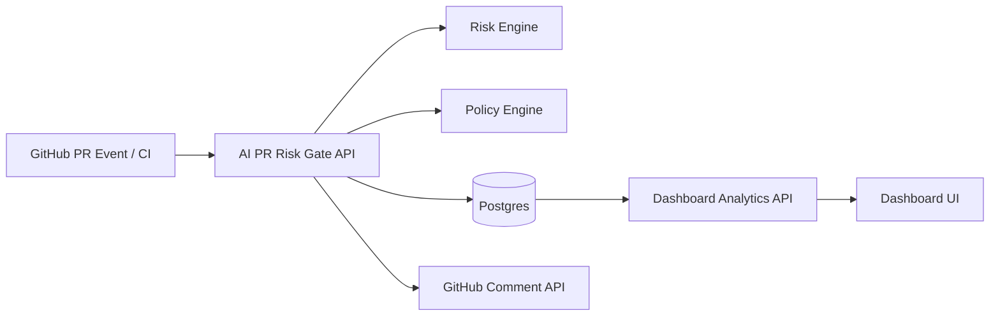

# Architecture

## Request flow
1. A PR event (webhook or CI payload) reaches `/webhook/github` or `/api/analyze`.
2. Files are analyzed with deterministic heuristic rules.
3. Policy threshold is applied (`RISK_POLICIES_JSON`).
4. Assessment is stored in Postgres.
5. Optional PR comment is posted with findings + policy decision.
6. Dashboard queries trends, severities, findings, and recent assessments.
