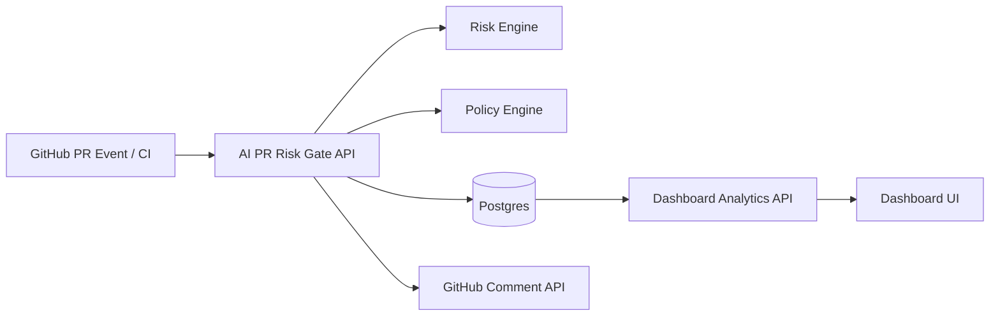

# Architecture

## Request flow
1. A PR event (webhook or CI payload) reaches `/webhook/github` or `/api/analyze`.
2. AuthN/AuthZ is applied (API key RBAC and webhook signature verification).
3. Files are analyzed with deterministic heuristic rules.
4. Policy threshold is applied (`RISK_POLICIES_JSON`).
5. Assessment is stored in Postgres.
6. Optional PR comment is posted with findings + policy decision.
7. Dashboard queries trends, severities, findings, and recent assessments.

## Runtime health model
- `/health/live` — process liveness
- `/health/ready` — dependency readiness (DB)
- `/health` — compatibility endpoint (readiness-aware)
